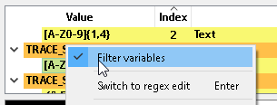
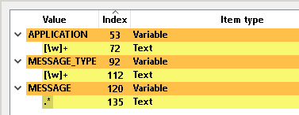
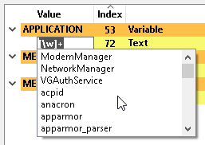
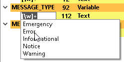
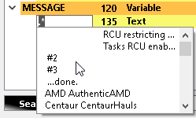
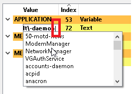

[**Go to the previous page**](../../README.md)

----

# Filters view

When you work with a complex regex expression, it is quite complex to find an important part of it in order to change some parameters.

E.g. the default regex, which is used in the one of the projects where this plugin is used consists of 1831 characters.
Try to find and change something in such a big string! It is a quite complex task.

To keep things easier, the "filters view" was introduced within the plugin. It does the following thing:

As you see above, each "VAR_TRACE_SPAM_APP" regex name is turned into a separate item in the tree view. It allows to build "regex with parameters" and easily exchange the content of your filter:

Change in a tree view is reflected in a final regex.

Also, selection within a tree view selects the corresponding part in the main regex input field:

If needed it is possible to switch from visualization of "Variables ONLY" to visualization of the whole regex:

----

> **Note!**
>
> Plugin implementation allows you to search within the variables.
> The search mechanism is based on the regex, thus you can apply some non-trivial search logic:
>
> 
>
> **This functionality is quite useful when you've formed a regex combination, which consists of several thousands characters and includes dozens of variables.**

----

> **Note!**
>
> Be aware, that used implementation of the regex engine supports groups with a name size of not more than 32 characters.
> If you'll use more characters in the name - engine will interpret the regex as invalid one.

----

> **Note!**
>
> Another small piece of interesting information. 
>
> In order to parse the regex and fill in the "filters view" ( the view which works with the variables - I guess you see those yellow-orange screenshots on this page ) it is not enough to use Qt's QRegularExpression class.
> Qt API does not provide information about hierarchy of the groups. 
>
> To reach the goal, we've used the antlr4 parsers generator - https://github.com/antlr/antlr4
>
> And the PCRE grammar, provided by the following repo - https://github.com/bkiers/pcre-parser
>
> We've modified above-mentioned grammar to allow faster parsing - https://github.com/svlad-90/DLT-Message-Analyzer/blob/master/thirdparty/pcre-parser/src/main/antlr4/nl/bigo/pcreparser/PCRE.g4
>
> The call to antlr generator is automated and is part of the CMake build.

----

## Auto-completion

Plugin's implementation supports auto-complete functionality for the "filters view".
All found regex captures are cached and used to help the user to go from the general to the specific queries.
Auto-completion functionality works for all "Group->Text" parts of the fiters view's tree.
The restriction is that the target group should have 1 single text child node. Otherwise auto-completion will not be applied.

How it works?

Imagine that you have bunch of the system journal messages:

You can use the following regex to build the "filters view":

> ^SYS JOUR [\d]+/[\d]+/[\d]+ [\d]+:[\d]+:[\d]+\.[\d]+ (?&lt;VAR_APPLICATION&gt;[\w]+)(\[[\d]+\])?: (?&lt;VAR_MESSAGE_TYPE&gt;[\w\d_-]+): (?&lt;VAR_MESSAGE&gt;.*)

Result "filters view" will look like this:

Click "Analyze" and perform the search:

You can either wait until the search is finished, or not. The auto-completion will be based on the currently available pre-cached data.
It will work even if completion data is not full yet. Of course, then the result will be limited to the available data.

Do a double click on the "Text" node within any of "APPLICATION", "MESSAGE_TYPE", "MESSAGE" variables.
You will see the completion list view:

You can type in the characters in order to filter out specific suggestions:

As we work with regexes, you might want to select more than one autocomplete value. In this case, once first element is selected, enter the pipe ( "|" ) to search again without discarding the previous input:

You can repeat this trick with pipe multiple times.

Auto-completion supports different kinds of settings, which can be changed by the user:

- **Case sensitive** - whether suggestions filtering is case sensitive or not
- **Max number of suggestions** - maximum number of suggestions, which is proposed to the user regarding its specific input
- **Max characters in suggestion** - maximum number of characters in the suggestion. If proposed string contains more characters, they will be cut off
- **Pop-up width** - width of the completion pop-up in pixels
- **Search policy** - policy used to filter out the suggestions. Either "starts with" or "contains"

----

## AND operator

If needed, "color", "variable", "plantuml", and any other supported regex name scripting options can be combined together with the help of the "_AND_" operator. This operator is case insensitive, so you can use also "_and_", "_AnD_", etc:

----

[**Go to the previous page**](../../README.md)