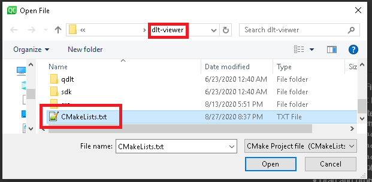
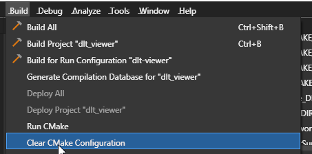

[**Go to the previous page**](../../README.md)

----

# Installation guide

- Clone the dlt-viewer project from the **[following location]( https://github.com/GENIVI/dlt-viewer )**.

> git clone git@github.com:GENIVI/dlt-viewer.git

----

> **Note!**
> 
> Currently plugin can be built against the v2.20.1 release.
>
> The build under the v2.19.0 is also supported. But you will need to use the compatibility mode. Such an option is described below. Search for the "PLUGIN_INTERFACE_VERSION" keyword.
>
> Be sure, that you've checked out the compatible base-line and used needed options. 

----

- Clone DLT-Message-Analyzer's git repository ( the one which you are observing right now ) as a nested one inside the **"./dlt-viewer/plugin"** location.
Your target path to the plugin should look like **"./dlt-viewer/plugin/DLT-Message-Analyzer"**:

>```
> cd ./dlt-viewer/plugin/DLT-Message-Analyzer
> git clone git@github.com:svlad-90/DLT-Message-Analyzer.git
> ```


----

- modify also the **"./dlt-viewer/plugin/CMakeLists.txt"**:

<pre>add_subdirectory(DLT-Message-Analyzer/dltmessageanalyzerplugin/src)</pre>


----

### Linux console build

- Open console in the "./dlt-viewer" folder:


- Run the following set of commands in it:

<pre>mkdir build
cd build
cmake ..
make -j4
</pre>

----

### Qt Creator IDE set up

- Specify the location of CMake in QT Creator:


Afterward, open the dlt-viewer's CMake project, which is located in the root of the dlt-viewer repo:




> **Important note for Windows compilation!**
>
> In addition to the already mentioned steps, for Windows you will need to modify the dlt-viewer's root CMakeLists.txt.
> Open the same file, which is mentioned in previous screenshot in the text editor, and add the following 2 lines:
> 
> if(NOT CMAKE_CXX_COMPILER_ID MATCHES "MSVC") # new line
>
> SET(CMAKE_C_FLAGS  "${CMAKE_C_FLAGS} -std=gnu99")
>
> add_definitions( "-Wall" )
>
> add_definitions( "-Wextra" )
>
> add_definitions( "-Wno-variadic-macros" )
>
> add_definitions( "-pedantic" )
>
> add_definitions( "-Wno-strict-aliasing" )
>
> endif()                                      # new line
>
> That will allow you to build plugin with CMake + MSVC + jom, avoiding compilation errors related to misusage of the GCC compiler flags.
>
> This issue is already raised in dlt-viewer's repo:
> https://github.com/GENIVI/dlt-viewer/issues/113
>
> Hopefully it will be fixed soon. Afterward, this step will become obsolete and will be removed from this guide.

----

> **Important note for Linux compilation!**
>
> On Linux the compilation might fail, if you do not have installed uuid-dev package.
> That one is used by antlr, which is used by the DLT-Message-Analyzer.
> 
> Thus, please, install it before making attempt to build the project:
> sudo DEBIAN_FRONTEND=noninteractive apt-get -yq install uuid-dev

----

## qmake *.pro based build

Such a build option was dropped.
DLT-Message-Analyzer has started to use antlr generator, which has only CMake support.
Thus the decision was finally made to support ONLY CMake builds for all supported platforms.
As of now, they are Linux and Windows.

----

### Linux and Windows QT creator build

- Select build type:


- Clear CMake configuration:



- Run CMake:


- Press build button:


----

### Run dlt-viewer and enable the plugin

- Proceed to the build's artifacts folder and run the dlt-viewer. It should already include and load the dynamic library of the DLT-Message-Analyzer plugin
- Enable and show the DLT-Message-Analyzer plugin:


----

### Build dependencies and settings

#### Build dependencies

> **Note!** 
> 
> For Linux build you will need to install the uuid-dev package. 
> It is required to build the antlr4 runtime library.
> To do that you can use the following commands:
>
> ```
> sudo apt update
> sudo apt-get install uuid-dev
> ```
>

----

> **Note!** 
> 
> If you want to have a compatible build with PLUGIN_INTERFACE_VERSION "1.0.0", enable the following define in the 
> **./dlt-viewer/plugin/ DLT-Message-Analyzer/ dltmessageanalyzerplugin/ src/ CMakeLists.txt**:
> 
> 

----

#### Build settings

> **Note!** 
> 
> If build fails due to missing qt5serialport5 package, perform the following commands:
>```
> sudo apt-get install libqt5serialport5
> sudo apt-get install libqt5serialport5-dev
>```
>

----

[**Go to the previous page**](../../README.md)