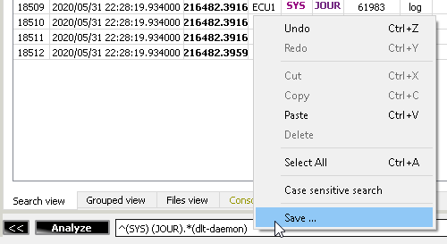
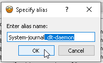
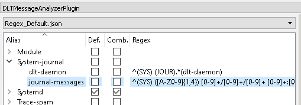
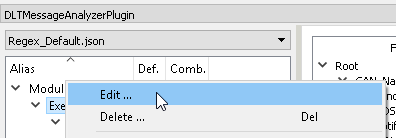
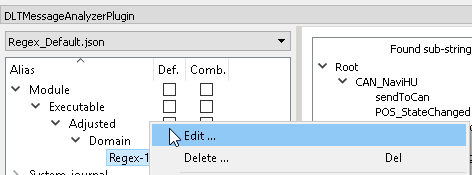
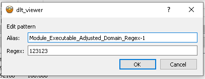
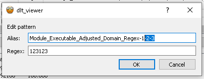
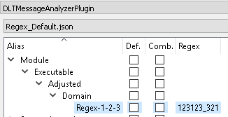
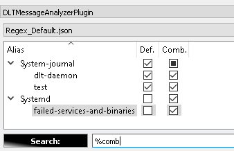
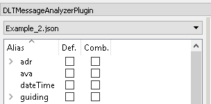

[**Go to the previous page**](../../README.md)

----

# Patterns view

Patterns view is an area, which allows you to manage the saved regex patterns.

## How does it look like?

----

## Pattern naming convention

Each tree level is formed via the "_" delimiter in the pattern name.

For example the following regex name:
<pre>Module_Executable_Domain_Regex-1</pre>

will form the following representation:

All saved patterns are represented as a tree-view.

----

## Saving the new regex patterns

In order to save a new element you can do the following.

Enter any useful regex expression into the "regex input" efit field:

Then, press right-click in order to visualize the context menu, and select the "Save ..." option:

Fill in the alias name. 
Depending on which element was the already selected one in the "Patterns view" the plugin might auto-fill part of the alias name, in order to locate new pattern in the same sub-tree.
After that press OK:

Check the result in the "Patterns view":

----

> **Note!**   The easiest way to use the newly saved regex pattern is to double-click on it.
> That will cause a search with usage of a stand-alone regex pattern.

----

## Relocation of the sub-tree levels

Plugin alllows you to move a particular sub-tree into another location.

Just select any non-leaf element:

Adjust its location, via e.g.:
- Addition of new sub-tree levels
- Removal of existing sub-tree levels
- Specifying the totally location

 

Press OK:

Check the modified tree:

 

----

> **Note!**   It is possible to move one sub-tree level into another one. In such a case plugin's implementation will merge both sub-trees.
> In case if 2 sub-trees will have collisions of leaf elements, the plugin will ask you regarding whether you want to overwrite the existing pattern with the candidate one.
> The promt will be provided for each collision.

----

## Editing the existing elements

You can edit an already exisitng patterns.

Just select any target leaf element:

Adjust its location, via e.g.:
- Addition of new sub-tree levels
- Removal of existing sub-tree levels
- Specifying the totally location
- Changing the regex name

Adjust the target regex.

 
 

Press OK:

Check the modified tree:

----

## Def. & Comb. options

Each saved regex pattern within the plugin as of now has 4 parameters, 3 of which are persisted:
- Regex alias - persisted
- Regex expression - persisted
- Default - persisted
- Combination - on start-up equal to Default parameter. In-RAM parameter only. Not persisted

The purpose of "default" and "combination" settings is to allow you to form a more complex regex expressions from a set of the saved ones.

> Some example from real project: you want to see "FPS of your app" & "CPU consumption of cgroups" & "Top 10 threads within the system" & "List of crashed systemd services".
> Combination of 4 regex patterns would easily allow to form such a request in ordeer to analyze performance issues.

As I can't provide here examples from the real project, here is another "simplification with screenshots".

----

I've created 2 patterns:
- One gets system joucnal messages of dlt-daemon
- Another one gets "logger_test" message from system journal and marks it as error.

I've checked "comb." setting of both patterns:

Now I've pressed "Enter" in order to apply the combination.
Result regex will consist of regexes of both parts of combination, concatenated with "pipe" OR operator:

The search result will consider both parts of request and will contain the following messages:

----

As you might assume, the "Def." option means the same as "Comb.", beside the fact that it gets persisted into the JSON configuration.
So on next each LC of the dlt-viewer, plugin will return back to the set of "Def." patterns.
You can think of it as of some sort of favorites option.

Another bonuses, whih come with this functionality, are the ability to:
- Instantly switch from any Comb. selection back to a set of "Def." favorites
- Clear the "Comb." selection in order to create some specific combination

----

> **Note!**   Above example is a simplification.
> But in case, if you have 100+ saved patterns, then those options will allow you to feel the power of deep analysis at your fingertips.

----

## Patterns search

"Pattern view" functionality allows you to search specific regex expressions by their aliases. 
Simply use the "Search" input field in order to narrow down the number of the shown regex patterns.
The regex expressions are used to implement the search, so you can combine multiple names with **"|"** operator:

----

Also there is a possibility to filter only comb or def patterns and hide all the others.

Type in **"%def"** in order to see ONLY "Def." patterns:

Type in **"%comb"** in order to see ONLY "Comb." patterns:

----

## Usage of multiple regex configuration files

Let's imagine, that 2 developers are working in the different teams and different domains of the same project.
And, for some specific case, one needs to get the "analysis domain knowledge" of the other in order to analyze a specific rare top issue.
Usually, such attempts end up with endless time-consuming ping-pong communications and meetings between the domains.

The plugin allows to shorten the time of knowledge transfer, as it allows you to work with multiple regex configuration files.
That means, that, if each domain is forming their "analysis knowledge" in form of the regex patterns within the plugin, the sharing becomes as trivial as sending the regex configuration file to the colleague.

The following option in the context menu of the "Patterns view" will allow you to open the location of the regex storage of the plugin within your filesystem explorer:

The opened file-system path would look something like this:

You can use that in order to add someone's configuration file, or to get yours.
The plugin's implementation continuously monitors the context of the folder.
As soon as it gets notification about the file-system update, it will update its own "available regex configurations" combo-box:

As soon as you will select the alternative regex configuration, the view will be updated with the new patterns:

----

> **Note!**  Plugin supports copy-paste of patterns between the files via the Ctrl+C and Ctrl+V shortcuts ( or via the corresponding context-menu items ). 
> It might become quite useful, in case if you'll decide to use some of the colleague's regexes in combination with your own ones.

----

[**Go to the previous page**](../../README.md)