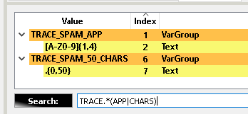
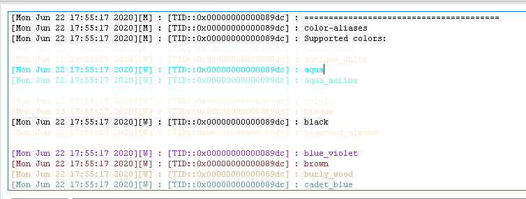

[**Go to the previous page**](../../README.md)

----

# Regex name scripting

DLT Message Analyzer plugin supports regex name scripting. It means, that the provided regex name might be considered by the implementation of the plugin and used by it in this or that view.

Currently, the following options are supported.

----

# Text coloring

By default, the plugin will highlight each regex group with some color. Default colors depend on the used user settings. By default, it will be a repetitive gradient consisting of 5 colors:

User can exchange the gradient settings in the context menu of the "Search view":

The default coloring can be overwritten by a regex name script.

Supported syntax options are:

**RGB_R_G_B** => e.g. RGB_0_0_0 stands for black:

**Color name** => e.g. BLACK:

**Status name** => e.g. ERROR:

Supported statuses are:

{"ok", QColor(0,150,0)}, 
{"warning", QColor(150,150,0)}, 
{"error", QColor(150,0,0)}

Coloring of the nested groups is also supported:

All the above parameters are case insensitive.

----

# Variables

When you are working with a complex regex expression, it is quite complex to find an important part of it in order to change some parameters.

E.g. the default regex, which is used in the one of the projects where this plugin is used consists of 1831 characters.
Try to find and change something in such a big string! It is a quite complex task.

To keep things easier, the variable scripting was introduced within the plugin. It does the following thing:

As you see above, each "VAR_TRACE_SPAM_APP" regex name will be turned into a separate item in the tree view. It allows to build "regex with parameters" and easily exchange the content of your filter:

Change in a tree view will be reflected in a final regex.

Also, selection within a tree view will select the corresponding part in the main regex input field:

If needed it is possible to switch from visualization of "Variables" to visualization of the whole regex:

All the above parameters are case insensitive.

----

> **Note!**
>
> Plugin implementation allows you to search within the variables.
> The search mechanism is based on the regex, thus you can apply some non-trivial search logic:
>
> 
>
> **This functionality is quite useful when you've formed a regex combination, which consists of several thousands characters and includes dozens of variables.**

----

> **Note!**
>
> Be aware, that the used implementation of the regex engine supports groups with a name size of not more than 32 characters.
> If you'll use more characters in the name - engine will interpret the regex as invalid one.

----

# AND operator

If needed, "color" and "variable" scripting options can be combined together with the help of the "_AND_" operator. This operator is case insensitive, so you can use also "_and_", "_AnD_", etc:

----

# Supported color names

To get the list of the supported color aliases, please, switch to the "Console view" tab, and enter the "color-aliases" command:

[**Go to the previous page**](../../README.md)