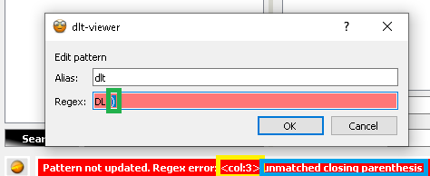

[**Go to the previous page**](../../README.md)

----

# Search

This chapter describes general aspects of the plugin's search functionality.

----

## How the search string is formed?

Currently plugin's implementation forms the search string in the following way:

> **Apid + " " + Ctid + " " + Payload**

As of now there is no way exist to change this rule. Still, implementation might be extended in the future releases to allow the runtime change of the search string.

----

> **Note!**
>
> Above means that you can easily: 
> - filter out messages of the specific application - e.g. ^DLTD
> - filter out messages, which originate from the specific context id of all applications - e.g. ^[\w]{1,4} CTX
> - filter out messages, which originate from the specific context id of the specific application - e.g. ^SYS JOUR
> - use your already existing regex expression, which do not consider the above filtering capabilities
>
> Together with the increased speed of the search this way of filtering becomes much more comfortable, than usage of the usual dlt-viewer's filters.
>
> However, the search is fully compatible with usage of the dlt-viewer's filters.

----

## Continuous search

Another thing, which differs between the "dlt-viewer's search" and the "plugin's search" is that DLT Message Analyzer allows to get the continuous updates of the search results.

Simply start the search:

You will see, that in case if your HU is connected, the search will continue to proceed with adding more and more results:

----

> **Note!**
>
> The continuous search will stop in the following cases:
> - loss of connection to the target
> - if user presses the "Stop search" button

----

## Case sensitive search

Be default the search is case insensitive. 
But, it is easy to change that via the search input field's context-menu:

The changed setting would be persisted and applied to all the next search operations.

----

## Regex errors handling

In case if user makes a mistake in the provided regex, the plugin will give a status bar notification with description of the error, which was provided by the used regex engine:

Notification message contains the col number, at which an error has occured. In addition to that, the regex line edit will jump to the error location and will select the col number character, which contains error. 

The same kind of error handling is also supported in the other menus, where user can enter the regexes, e.g. during the edit operation of the previously saved pattern: 

----

## Used regex engine

The plugin's implementation is using the QRegularExpression regex engine, which is a PCRE one.
It works much faster than the QRegExp, which is still used in the dlt-viewer's v.2.19.0.

Qt documentation itself tells:
>https://doc.qt.io/qt-5/qregularexpression.html#notes-for-qregexp-users
>
>The QRegularExpression class introduced in Qt 5 is a big improvement upon QRegExp, in terms of APIs offered, supported pattern syntax and speed of execution. 

And we've checked that. It really works faster and provides a deeper support of the regex syntax.

----

[**Go to the previous page**](../../README.md)