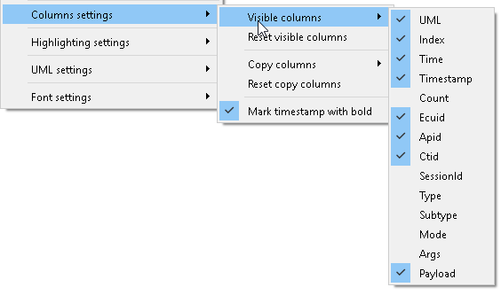
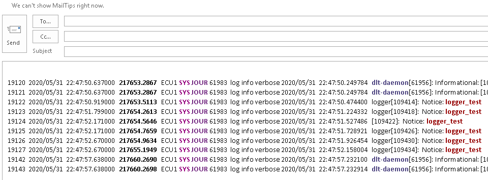
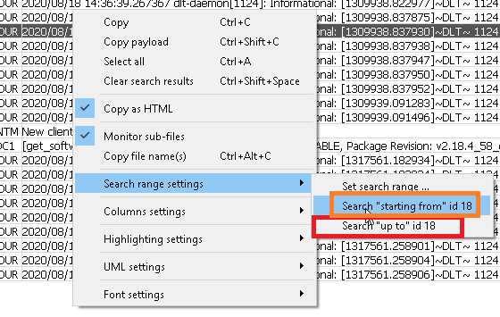
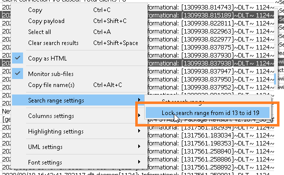

[**Go to the previous page**](../../README.md)

----

# Search view

Plugin's "search view" is the analog of the dlt-viewer's "Search Results" section, meaning that its main purpose is to represent you the find result entries.
Still there are additional things which it does on top of what the standard functionality of the dlt-viewer provides to you.

----

## How does it look?

----

## Copy-paste extensions 

As in the dlt-viewer, the view allows you to copy the whole message, or only the payload:

Besides that, you can select the visible columns:

----

>**Note!** Copy operation will consider ONLY visible columns, making it possible to copy ONLY needed amount of information.

----

On top of that the "search view" allows you to copy-paste the highlighted text.
Just turn on the "Copy as HTML" option to allow copy-paste of the formatted text:

Then copy-paste any found rows into your email:

----

> **Note!** You can paste highlighted text to any application, which supports representation of colored content, e.g. Word, Excel, Outlook, etc.
> For other text editors, plain text will be pasted.

----

## Lock the search range

Another feature of the "Search view" is called a "Lock search range".
It allows you to specify, which range of the message id-s should be considered during the search. Other messages will be skipped by the search algorithm, making it to run much faster.

----

> **Note!** It really helps while you work with huge DLT files.
> E.g. you have 10 Gb DLT file with the 3 hours of tracing, while you are insterested in specific use-case, which took around several minutes.

----

There are 3 ways to specify the search range within the plugin's implementation:

- Select already found row and specify whether it should be considered as "start search" or "end search" point:

- Select 2 already found rows and specify, whether that pair should be considered as "start & end" search points:

- Enter start and end message id-s manually:

  

----

> **Note!** The dialog, that will appear, will show you the minimum and maximum message id-s, which are available in the loaded DLT file.

----

After the lock is not needed anymore, you can remove it using the following context-menu item:

----

### Example of the applied "lock search range"

  

----

## Mark timestamp with bold

A small feature, which allows a search view to mark the timestamp column with bold.
Nothing special, still it is quite useful when you want to emphasize that time is an important part of the copy-pasted messages:

 
 

----

[**Go to the previous page**](../../README.md)