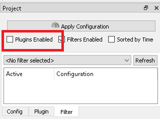

[**Go to the previous page**](../../README.md)

----

# Troubleshooting

## Instance of dlt-viewer has an old-fashion styling

Majority of the users are using dlt-viewer with the default styling, which is "windowsvista".

If you build dlt-viewer with Qt version which is equal or greater than 5.10, you should be aware that "windowsvista" styling has become a separate dynamic library there.

In order to check whether it is still available or not you can switch to the "Console view" and input "styles".
That will show you used, and available style sets:

You can select one of the available styles using the "-style" command line option, e.g.:

> ./dlt-viewer -style Fusion

In case if "windowsvista" style is missing in the above list, you can add it to the final deployment of the dlt-viewer in the following way:
> Take it from: "&lt;Qt_ROOT&gt;\\&lt;Qt_version&gt;\\&lt;Qt_toolchain&gt;\plugins\styles\qwindowsvistastyle.dll" // or *.so, depending on the used OS.
>
> Place it to: ".\dlt-viewer\styles\qwindowsvistastyle.dll" // or *.so, depending on the used OS.

Then reboot the dlt-viewer. Addition style should become available.

----

## When I try to perform a search within athe DLT-Message-Analyzer plugin, I do get the "Initial enabling error!"

In older version the error looks like this:

In newer versions - like this:

In general, you get this error, when dlt-viewer core is not providing to the plugin a pointer to the dlt file through the plugin's API. 

It doesn't really matter whether you have opened any dlt file or not. 
Dlt-viewer always has connection to some file:
- if you've opened the file - dlt-viewer will use it
- if you haven't opened any file - dlt-viewer will itself implicitly create and use a temporary file

But in case when you get the above-mentioned error, something went wrong, and file is not provided.
Another proof of that would be an empty "Files view" of the plugin:

----

**Why could that happen? We've identified the following reasons.**

----

#### 1. You have disabled "Plugins enabled" option on dlt-viewer's "Filter" tab and restarted the dlt-viewer:

The possible measures of avoidance in this case are:
-	Turn on “Plugins Enabled” option and open another dlt file or dlt session with the target
-	Turn on “Plugins Enabled” option and then restart dlt-viewer

----

#### 2. You have compiled newer version of the dlt-viewer, which has settings incompatible with an older version.

The are possible measures of avoidance for this issue.

On Windows:
- Close dlt-viewer.
- Go to "C:\Users\&lt;UserName&gt;\.dlt\config"
- Remove "config.ini"
- Start dlt-viewer

On Linux:
- Close dlt-viewer.
- Go to "/home/&lt;UserName&gt;/.dlt/config"
- Remove "config.ini"
- Start dlt-viewer

If that does not help, you can also try to press "Ctrl+K" in dlt-viewer in order to reset the used file.

----

If above instructions didn't help you - create a new issue [here](https://github.com/svlad-90/DLT-Message-Analyzer/issues) 

----

[**Go to the previous page**](../../README.md)